# horticulture_panel
Inspired by a recent Great Scott [video](https://www.youtube.com/watch?v=4FryMPpJG6I) and a coincidental attempt to kickstart my balcony garden for the upcoming season, I attempted a reimplementation of the Würth Elektronik [Lighting Development Kit's](https://www.we-online.com/catalog/en/LIGHTING_DEVELOPMENT_KIT) horticulture panel.

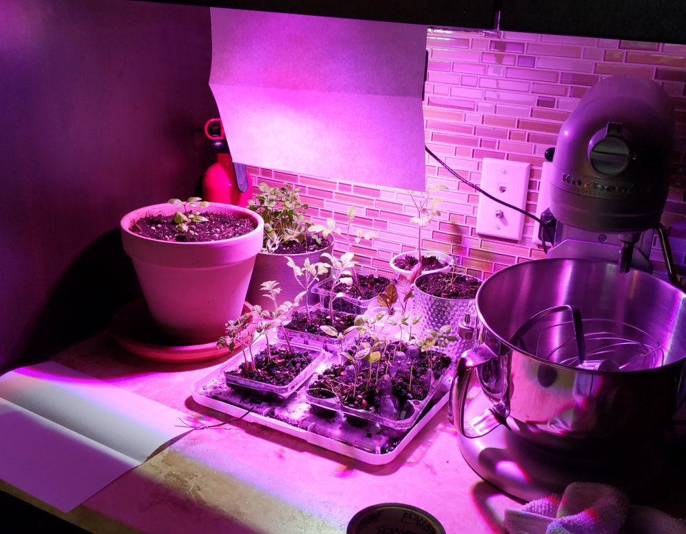 <b>completed panel illuminating my kitchen garden</b>

This design maintains the same wavelengths and corresponding maximum power outputs as the reference design while merging all of the LEDs, drivers, and simplified manual dimming controls onto a single compact PCB.

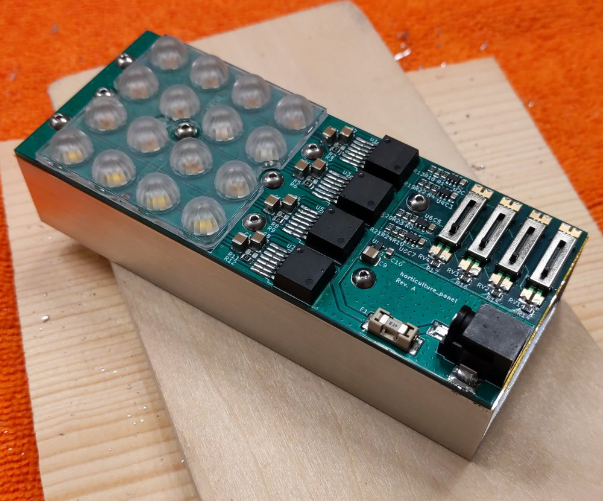 <b>panel assembly with candidate heatsink</b>

The files needed to build a panel for yourself are located in the [build](/build) directory, and the KiCAD source files, libraries, and models in the [kicad](/kicad) directory. I recommend reading this description before proceeding, as there are important considerations throughout - particularly about PCB assembly and thermal management.

# design

## LED and drivers
This design uses the same type and quantity of LEDs as the Würth Elektronik panel. There are four different types of LEDs, targeting the wavelengths needed to promote various stages of plant growth. LEDs of the same wavelength are connected in series to a single constant current LED driver, so they can be dimmed together. Both fixed 350mA and adjustable resistor footprints are available, but only one should be populated at a time.

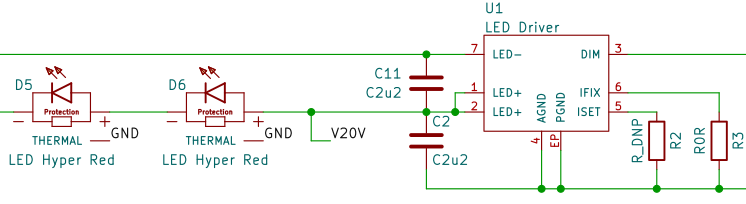 <b>two of the six <i>hyper red</i> LEDs and their associated driver</b>

The LEDs are arranged in a grid with 12.5mm spacing to fit the selected Ledil C16597 lens. The footprints for the LEDs and drivers were expended to allow hand soldering.

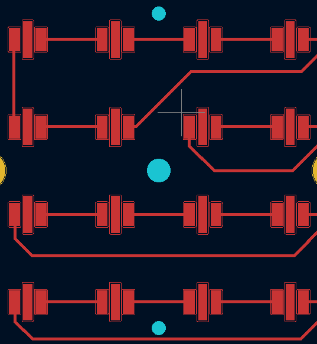 <b>LED array with expanded footprints and lens mounting holes</b>

## thermal

Heat is a key consideration. A simple estimate - considering the total power delivered minus the power emitted as light - suggests an approximate output power of 6W of light and 8W of heat.

| LED Type  | Forward Voltage @ 350mA | Power In | Radiant Flux | Heat   | Quantity |
|:----------|:------------------------|:---------|:-------------|:-------|:---------|
| Hyper Red | 2.2 V                   | 0.77 W   | 0.44 W       | 0.33 W | 6        |
| Deep Blue | 3.2 V                   | 1.12 W   | 0.60 W       | 0.52 W | 2        |
| Far Red   | 1.8 V                   | 0.63 W   | 0.35 W       | 0.28 W | 4        |
| Daylight  | 3.2 V                   | 1.12 W   | 0.20 W est.  | 0.92 W | 4        |

This is the extent of the formal thermal analysis. However, heat dissipation was a key part of the PCB design. Vias were placed underneath the LED and driver thermal pads, in addition to a grid of vias in the area near the LEDs and drivers. The rear side of the PCB has no components and is almost entirely ground plane. This both promotes heat transfer to the heat sink and minimizes the risk of shorts to ground. The four traces that do traverse the bottom side contain the low-energy PWM signals. There are a number of mounting holes near the LEDs and drivers to provide contact force to the heatsink.

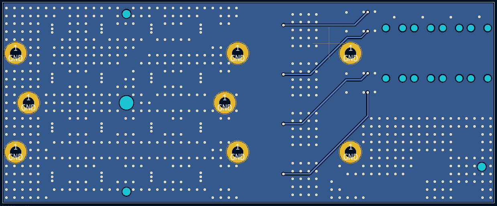 <b>PCB rear showing ground plane, thermal vias, mounting holes, and PWM trace traversal</b>

My candidate heatsink is a section of McMaster [6546K2](https://www.mcmaster.com/6546K2/) 2x1-inch rectangular aluminum extrusion, cut to length, drilled, and tapped. A layer of kapton tape between the heatink and PCB provides an additional layer of isolation from the PWM traces and acts as a basic thermal pad. Specific results will depend on your heatsink and thermal environment. The included step file can assist with locating mounting holes and designing the mechanical interface.

## control
While the LED drivers have an adjustable current output, PWM control preserves the color characteristics of the LEDs - which are nominally designed for 350mA - and allows dimming to zero intensity.

This design uses four Analog Devices LTC6992-1 voltage-controlled pulse width modulators to convert analog outputs from four corresponding potentiometers into the required control signals. A convenient [online tool](http://beta-tools.analog.com/timerblox/LTC6992) simplifies the design of LTC6992 circuits. The selected resistors produce an operating frequency of approximately 220Hz, which should exceed the [flicker fusion threshold](https://en.wikipedia.org/wiki/Flicker_fusion_threshold) in most cases and approximates the 244Hz example in the LED driver datasheet.

Despite the possible reductions in size and cost, I decided not to use a microcontroller for PWM control. Primarily, I wanted to avoid software as part of this project. However, the apparent benefits are somewhat offset by the I/O requirements (minimum 4 analog input and 4 PWM output), additional power draw on the 5V supply, and need for programming headers.

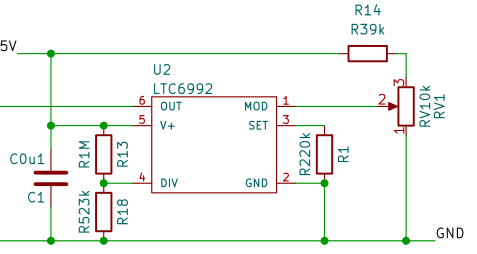 <b>control circuit</b>

Sourcing a suitable surface mount potentiometer was surprisingly difficult. The resulting linear potentiometer provides clear visual feedback when the panel is unpowered. There are four copies of the same circuit, aligned for east hand soldering, with compromises as required to the recommended layout.

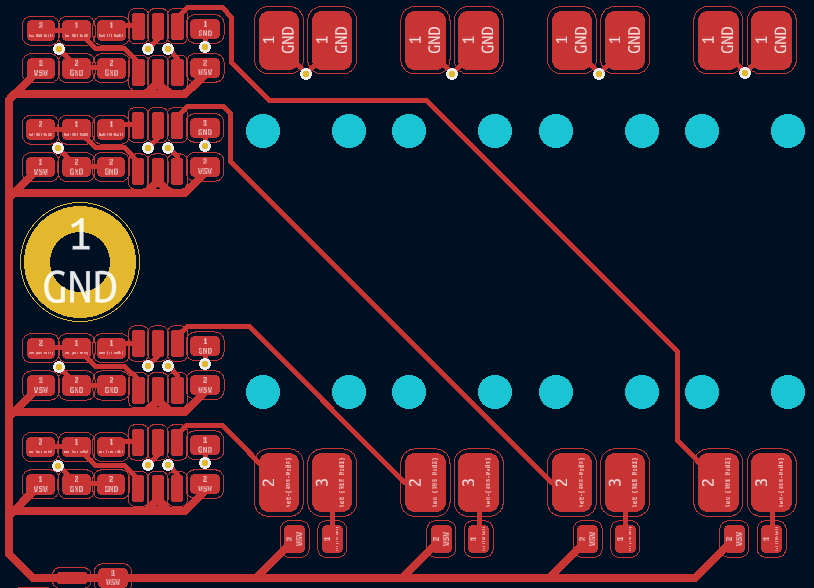 <b>layout of qty(4) control circuits</b>

Absent a control input, LED drivers will operate at 100% duty cycle. Depending on your application and desire to adjust light intensities, you may choose to omit the control elements for one or more of the drivers.

## power
The six series Hyper Red LEDs may need up to 15.6V to overcome the worst-case forward drop of 2.6V (vs. 2.2V typical). The panel accepts a nominal 20V through a 2.5x5.5mm barrel jack, with center positive and barrel ground. I use a USB Power Delivery mains adapter with 20V trigger cable. There is a 2A fuse at the input sized to protect the smallest 20V trace. The input power is not reverse polarity protected or filtered.

The control circuits require 5V power, which is provided by a linear regulator. The control circuit current is on the order of 1mA - well below the capability of the selected ZXTR2105F regulator with 20V input.

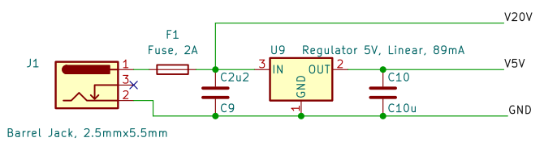 <b>power input and 5V regulator</b>

# assembly

This is a challenging assembly, but it is designed for hand soldering with the right equipment. The primary challenges are the large ground planes needed for heat dissipation during operation, and the relatively small footprints.

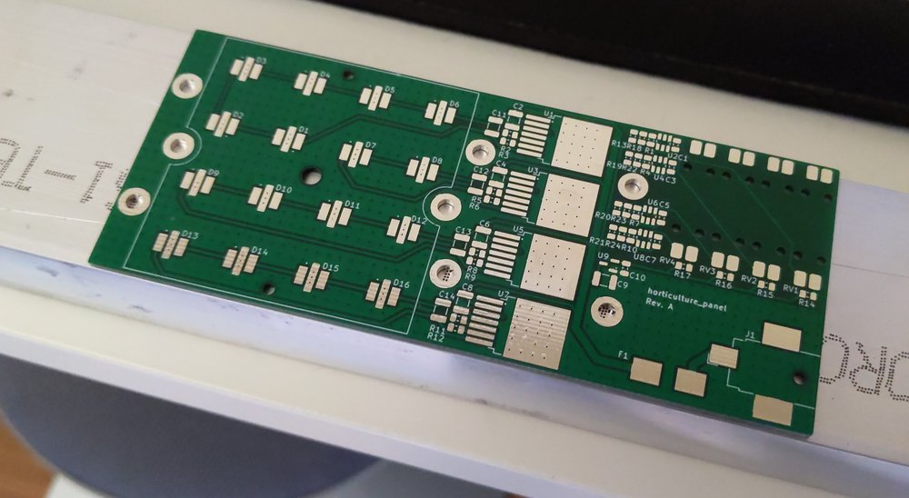 <b>bare PCB with candidate heatsink stock</b>

I achieved a successful result soldering the LEDs using a [Miniware MHP30](http://www.miniware.com.cn/product/mhp30-mini-hot-plate-preheater/) to locally preheat to 150°C, manually applying solder paste, then soldering each joint for 15 seconds at 300°C with an iron.

The thermal pad of the LED drivers does not extend to the edge of the package like a typical TO263-7. While I designed enough extra pad area to hand solder the thermal pad using a similar process to the LEDs, I decided to reflow with the hot plate.  

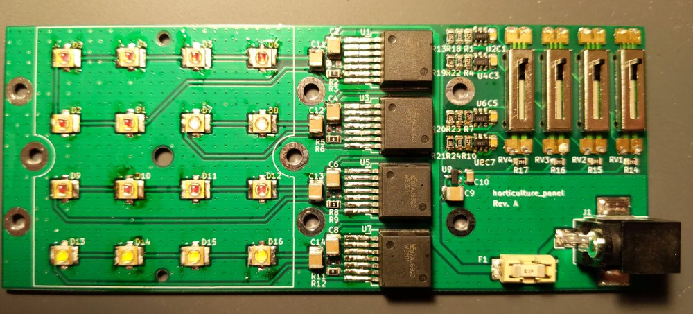 <b>populated PCB</b>

The remaining components are standard surface mount and can be soldered according to your preferred technique.

# performance

Qualitatively, the lights turn on, are very bright, and change intensity as expected. My USB PD wattmeter shows 17W, which aligns reasonably well with the 14W predicted and is easily explained by higher than typical forward voltages in some of the LEDs.

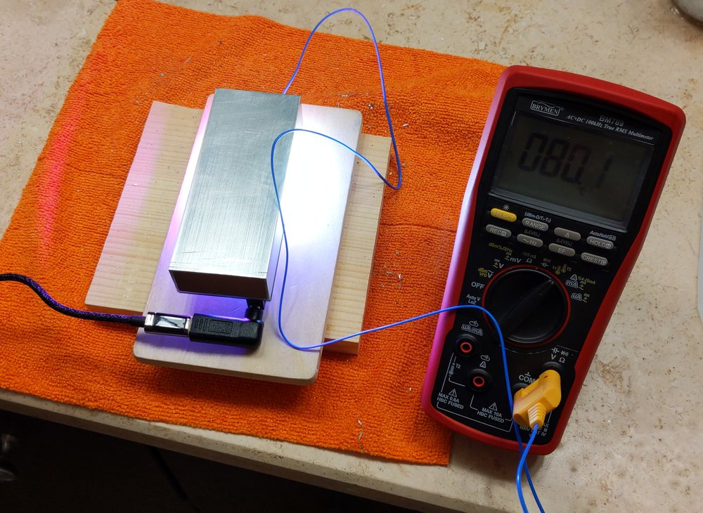 <b>thermal checkout showing steady state temperature with all lights at 100%</b>

The heatsink is capable is maintaining 80°C steady state in a 20°C room without airflow and with all lights at 100% power. In practice, to achieve the correct mix of wavelengths for each growth phase, not all of the lights will be active or at 100%; so the practical working temperatures will be lower. For comparison, the LED bulbs I use for home lighting consume 6W and reach a temperature of 65°C, which suggests this is a reasonable result. Your requirements will vary and will inform the design of your heatsink and mounting solutions.

Regarding plant growth, it's too soon to tell.

# revision history
## Rev. A 2022-03-05
### changelog
Initial release.

### known issues
1. When a LED channel is commanded to 0% duty cycle, touching that channel's driver circuit can command the lights to flicker. I believe this is caused by the relatively high 50kΩ resistance of the potentiometer circuit failing to overcome the stray voltages and can be solved by selecting a lower value potentiometer - taking note of total current from the 5V regualtor - or adding a buffer stage near the potentiometer before wiring to the PWM converter.

1. The selected 10kΩ potentiometer is paired with a 39kΩ series resistor to provide 0V to 1.02V to the LTC6992 converter. This range is slightly biased towards allowing 100% brightness and does not account for the tolerances of the selected parts. In practice,  human precision and the short travel of the linear potentiometers are the limiting factors in selecting the brightness level, but the circuit could be tuned if desired by including a trimmer to adjust the upper limit closer to 1V.

1. While the sequential arrangement of LEDs simplifies trace routing and allows all power traces to be on the top layer, it also clusters LEDs of the same wavelength together and might cause certain plants to receive more of one type of light than another. For my intended home use, I will solve this by maintaining a reasonable distance between the panel and plants, but a larger array might consider a different arrangement.

# license
 The horticulture_panel is licensed under [CC BY-NC-SA 4.0](https://creativecommons.org/licenses/by-nc-sa/4.0/). Attribution may be provided by link to this repository.
